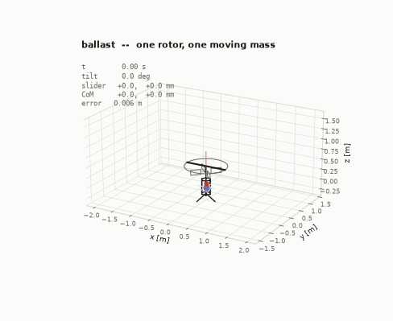
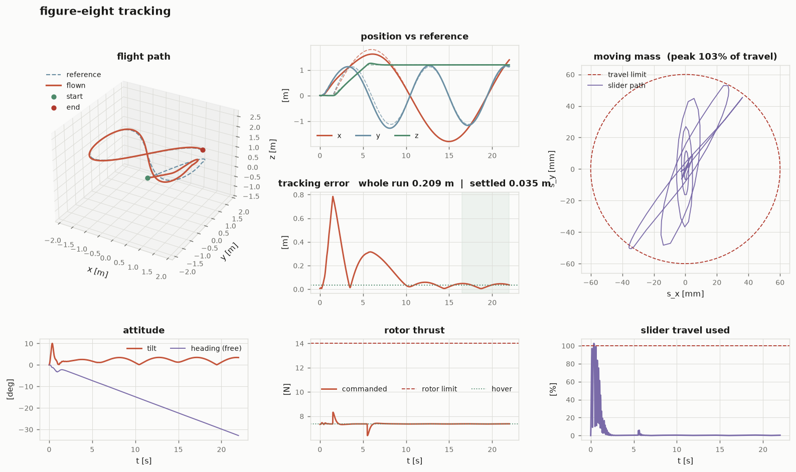
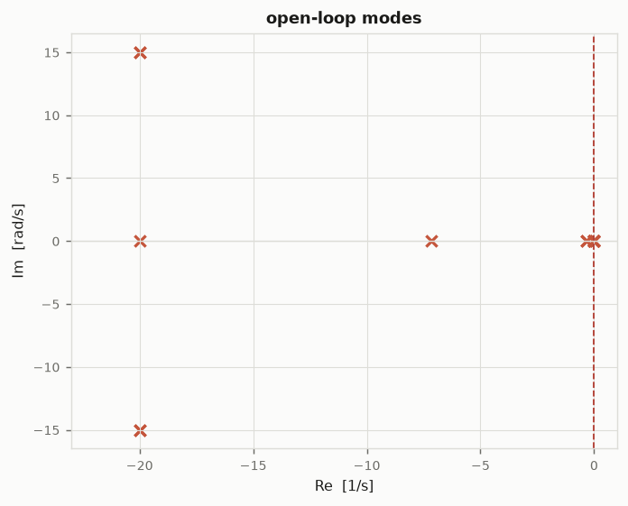

# ballast

**A single-rotor UAV that steers by moving its own centre of gravity.**

One motor. No swashplate, no tail rotor, no second propeller, no tilting nacelle.
The vehicle points itself by sliding a mass inside its own fuselage: that moves the
centre of mass off the thrust line, and the rotor's own thrust does the steering.

<p align="center">
  
</p>

This repository contains the full nonlinear multibody model, the trim and
linear-stability analysis, a cascaded flight controller, and a validation suite
that flies the thing — in pure Python, with NumPy as the only required dependency.

---

## The idea

```
                   ______________                  rotor: fixed pitch, fixed
                  /              \                 to the airframe.  Thrust is
                 '----------------'                always along +z_body.
                        |  |
                     ,--+--+--.                    anti-torque stator vanes,
                     '--+--+--'                    fixed, in the slipstream
                        |  |
                   .----+--+----.
                   |            |
                   |   O <------+---------- shell centre of mass (body origin)
                   |            |
                   |  =====M==  |  <------- the moving mass, on two orthogonal
                   |            |           rails, ±60 mm of travel
                   |            |
                   '--\------/--'
                      /      \
```

The rotor thrust `f` acts along the body z-axis, applied at `r_t`. With the system
centre of mass at `c`, the moment about it is

$$\tau \;=\; (r_t - c)\times f\hat z_b \;=\; f\begin{bmatrix}-c_y\\ c_x\\ 0\end{bmatrix}$$

Two consequences define the entire vehicle:

1. **Steering is a pure lever.** Shift the centre of mass sideways by `c`, get a
   torque `f·|c|`. Inverting it is trivial, so control allocation is exact.
   Note what is *absent*: the vertical lever `r_{t,z} − c_z` scales nothing. How
   high you mount the rotor does not change the steering authority at all.

2. **Yaw is unreachable.** The third row is identically zero. No slider position
   produces a moment about the thrust axis, so heading cannot be commanded. It is
   left to fixed anti-torque vanes, and what they miss becomes a slow, bounded drift.

Authority is small and it is the whole design problem: a 150 g mass on ±60 mm rails
inside a 750 g vehicle moves the centre of mass by **12 mm**, giving **88 mN·m** at
hover thrust — about **9.7 rad/s²**. A 250 g racing quadrotor reaches roughly 200.

---

## The result worth reading

A moving-mass actuator does not only shift the centre of gravity. Accelerating the
mass also *pushes back* on the airframe:

$$-\dot h_{\mathrm{rel}} = -\mu\,(s\times\ddot s),\qquad \mu=\frac{m_b m_s}{M}$$

That reaction arrives **immediately**, while the steering torque it is meant to
produce only appears once the mass has actually travelled. Its sign is set by one
design choice — the height of the rails relative to the shell centre of mass:

| rails 30 mm **below** CoM | rails 30 mm **above** CoM |
|---|---|
| reaction tilts the vehicle the way the CoM shift eventually will | reaction tilts it the *wrong way* first |
| the actuator **leads** | the plant is **non-minimum phase** |
| step response: **3 mm** RMS, 6.7° peak tilt | step response: **354 mm** RMS, 43.5° peak tilt |

Same mass, same travel, same gains, same rotor. Flipping the rails costs two orders
of magnitude in tracking accuracy and six times the peak tilt.

A model that shifts the centre of mass but freezes the inertia tensor and drops the
reaction terms — the usual shortcut — gives **the same answer for both layouts** and
cannot see this at all. During a fast slider move those "neglected" terms reach
**92–113 % of the vehicle's entire steering authority**. They are not a correction;
they are the dominant transient, and they are perfectly correlated with the control
input, which is the worst kind of disturbance to leave out of a model you intend to
tune a controller against.

Reproduce it:

```bash
python examples/06_where_to_put_the_rails.py
```

---

## Validated performance

Every row is produced by the code in this repository, from the same default vehicle
and the same controller gains. `settled` means the last 15 s of the run (5 s for the
step and upset cases).

| scenario | settled RMS | settled max | peak tilt | slider used |
|---|---|---|---|---|
| hover, released 0.54 m off station | < 0.1 mm | < 0.1 mm | 2.8° | 75 % |
| step to (1.5, −1.0, 2.0) m | 3 mm | 5 mm | 6.7° | 86 % |
| circle, 2 m radius | 5 mm | 6 mm | 7.5° | 101 % |
| helix, 0.3 m/s climb | 22 mm | 23 mm | 7.4° | 102 % |
| figure-eight, 2 m | 25 mm | 36 mm | 9.4° | 102 % |
| upset recovery: 25° and 1.3 m/s | < 0.1 mm | < 0.1 mm | 30.2° | 103 % |
| station keeping, 2 m/s wind + gusts | 38 mm | 74 mm | 1.1° | 4 % |
| station keeping, 4 m/s wind + gusts | 0.15 m | 0.29 m | 4.5° | 16 % |
| station keeping, 7 m/s wind + gusts | 0.54 m | 1.17 m | 13.4° | 50 % |
| station keeping, 10 m/s wind + gusts | 1.63 m | 2.90 m | 25.1° | 100 % |

Notes on reading this honestly:

- The sub-millimetre rows are real but unremarkable: with no disturbance after
  settling, the integrator drives steady-state error to zero. They test recovery,
  not precision.
- Slider usage above 100 % is the position servo overshooting its command. The
  per-axis end-stops still bound the physical travel, and a test asserts it.
- 10 m/s is the edge. The slider is saturated, tracking has degraded by a factor
  of forty, and the vehicle holds — but it is no longer doing useful work.

<p align="center">
  
</p>

---

## Quick start

```bash
git clone https://github.com/Omammadlidev/ballast
cd ballast
pip install -e ".[viz]"        # omit [viz] for NumPy-only; matplotlib is optional
```

```bash
ballast info                                   # sizing, limits, trim residual
ballast modes                                  # linearise about hover, list the modes
ballast envelope                               # steering margin vs steady wind
ballast fly figure8 --duration 40 --dashboard out.png
ballast fly hover --wind 6 --gust 2 --duration 45
```

```python
import ballast as B

veh = B.Vehicle()
tel = B.Simulator(veh, dt=2e-3, wind=B.Wind((4.0, 2.0, 0.0), sigma=1.2)).run(
    B.FlightController(), 45.0,
    trajectory=B.trajectories.figure_eight(amplitude=2.0))

print(tel.summary("gusty figure-eight"))
print(f"settled RMS {tel.rms_error(last_seconds=15.0):.3f} m")
```

---

## The model

**State** (18): system centre-of-mass position and velocity in world coordinates,
attitude quaternion, body rates, rotor speed, and the slider's position and velocity.

Integrating the *system* centre of mass rather than an airframe-fixed point makes
Newton's second law exactly `M·a_G = F`. The airframe origin — where sensors and
payload actually sit — is recovered from it, including the slider-motion coupling
term that a naive implementation drops.

**Rotation.** The shell carries a point mass at body position `s(t)`. Measuring both
bodies from the system centre of mass, their parallel-axis contributions collapse
into a single reduced-mass term:

$$J_G(s) = J_b + \mu\big(s^\top s\,I - ss^\top\big),\qquad
  h_{\mathrm{rel}} = \mu\,(s\times\dot s)$$

$$J_G\dot\omega = \tau_G - \omega\times\big(J_G\omega + h_{\mathrm{rel}}\big)
  - \dot J_G\,\omega - \dot h_{\mathrm{rel}}$$

Every term is retained. The derivation is in [`ballast/multibody.py`](ballast/multibody.py)
and at more length in [`docs/THEORY.md`](docs/THEORY.md).

**Also modelled:** first-order rotor spool-up; anti-torque stator vanes whose
recovered torque scales with thrust exactly as the reaction does, so their
cancellation ratio is thrust-independent and set only by build tolerance;
quadratic aerodynamic drag at a centre of pressure deliberately placed slightly
below the centre of mass; per-axis rate damping; a second-order slider servo with
travel, rate and end-stop limits; and Ornstein–Uhlenbeck wind turbulence.

### Open-loop modes

`ballast modes` linearises in 17 error coordinates — an attitude perturbation acts
multiplicatively, so the Jacobian is not rank-deficient the way a raw quaternion
Jacobian would be — and every mode it finds can be predicted in closed form:

| eigenvalue | ζ | τ [s] | what it is | predicted by |
|---|---|---|---|---|
| −20.00 ± 15.00j | 0.800 | 0.050 | slider position servo | `−ζωₙ ± jωₙ√(1−ζ²)` |
| −20.00 | 1.000 | 0.050 | rotor spool | `−1/τ_spool` |
| −7.14 | 1.000 | 0.140 | yaw rate damping | `−k_z / J_zz` |
| −0.33 | 1.000 | 3.036 | roll/pitch rate damping | `−k_x / J_xx` |
| 0 (×9) | — | ∞ | rigid-body integrators | position, the `x ← v ← θ ← ω` chains, free heading |

Agreement is to 10⁻⁶ or better, which is a real check that the nonlinear model and
its linearisation describe the same vehicle. `python examples/05_linear_analysis.py`
prints the comparison.

The vehicle is **marginally stable, not self-stabilising** — as every thrust-vectored
hovering machine is. It flies entirely on feedback.

<p align="center">
  
</p>

---

## Honest limitations

These are properties of the architecture, not gaps in the code. Each one is asserted
by a test, so none of them can quietly change.

- **No yaw control.** Structural: the allocation matrix's yaw row is identically
  zero. Heading drifts at about **1.5 °/s** with vanes trimmed to 99.5 %. Set
  `vane_ratio = 1.0` and it holds heading exactly.
  Position accuracy is *unaffected* — the controller frames its attitude command
  around the vehicle's current heading, so a slowly rotating airframe costs nothing.
  A test asserts the vehicle really does rotate 90° while holding station to 0.1 mm.
- **Slow attitude.** Peak angular acceleration is 9.7 rad/s², roughly twenty times
  lower than a small quadrotor. Gains are tuned to that reality, not borrowed from
  multirotor practice. The outer loop's tilt cone (25° by default) is an honest
  expression of it: asking for more is a promise the slider cannot keep.
- **Authority scales with thrust.** The vehicle is least controllable exactly when
  it is descending fastest.
- **Rate-limited before servo-limited.** The slider reaches its 0.8 m/s speed limit
  at 2.1 Hz, below the servo's 3.5 Hz bandwidth. `ballast info` reports which binds.
- **Static and dynamic wind limits differ, a lot.** Steady-trim margin survives to
  18.5 m/s; gusty closed-loop station keeping is already degraded at 7 m/s. The
  second number is the one that matters.
- **Simulation, not flight test.** Quasi-steady aerodynamics, a point-mass slider,
  no rotor inflow or ground effect, no sensors or estimator — control runs on true
  state. Adding an estimator is the obvious next step.

---

## What is in the box

| module | contents |
|---|---|
| [`params.py`](ballast/params.py) | vehicle, rotor, slider and aero parameters; derived sizing |
| [`multibody.py`](ballast/multibody.py) | exact shell + moving-mass rotational dynamics |
| [`dynamics.py`](ballast/dynamics.py) | the 18-state derivative, actuators, frame bookkeeping |
| [`sim.py`](ballast/sim.py) | RK4 integrator, end-stops, telemetry and metrics |
| [`trim.py`](ballast/trim.py) | hover trim, error-state linearisation, mode classification |
| [`control/`](ballast/control) | position PID → SO(3) attitude → CoM allocation |
| [`analysis.py`](ballast/analysis.py) | authority, bandwidth and wind envelopes |
| [`viz/`](ballast/viz) | telemetry dashboards, pole maps, 3-D animation |

```
examples/
  01_vehicle_and_limits.py      what the airframe can and cannot do
  02_hover_and_step.py          station keeping and a step
  03_trajectory_tracking.py     figure-eight, helix, circle
  04_wind_envelope.py           static margin vs dynamic station keeping
  05_linear_analysis.py         every mode checked against theory
  06_where_to_put_the_rails.py  the design result above
```

---

## Tests

**81 tests**, NumPy-only, no fixtures that mock away the physics.

```bash
pip install -e ".[dev]"
pytest -q
```

The interesting ones do not check that the code runs; they check that it is *right*:

- `J_G` from the reduced-mass identity equals a brute-force two-body sum (200 random
  slider positions, `atol=1e-15`)
- `dJ_G/dt` matches finite differences
- with no applied torque, world angular momentum and rotational kinetic energy are
  conserved to **1 part in 10¹⁰** over 2 s of RK4
- with the slider frozen, the model reduces to plain Euler equations *exactly*
- control allocation inverts the torque map to `atol=1e-14`, and saturation preserves
  torque direction
- the slider command can never leave the rails, over 500 random torque demands
- every linear mode matches its closed-form prediction
- the rotor mount height provably does not affect steering torque
- the rail-height result above, so it cannot regress

---

## References

Moving-mass actuation is not new — it is standard on re-entry vehicles and has been
studied for fixed-wing aircraft. Applying it to a *single-rotor hovering* vehicle,
and taking the multibody coupling seriously rather than freezing the inertia tensor,
is the less common part.

1. Petsopoulos, T., Regan, F. J., and Barlow, J.,
   "Moving-Mass Roll Control System for Fixed-Trim Re-Entry Vehicle,"
   *Journal of Spacecraft and Rockets*, Vol. 33, No. 1, 1996, pp. 54–60.
   [doi:10.2514/3.55707](https://doi.org/10.2514/3.55707)
2. Robinett, R. D. III, Sturgis, B. R., and Kerr, S. A.,
   "Moving Mass Trim Control for Aerospace Vehicles,"
   *Journal of Guidance, Control, and Dynamics*, Vol. 19, No. 5, 1996, pp. 1064–1070.
   [doi:10.2514/3.21746](https://doi.org/10.2514/3.21746)
3. Erturk, S. A., and Dogan, A.,
   "Dynamic Simulation and Control of Mass-Actuated Airplane,"
   *Journal of Guidance, Control, and Dynamics*, Vol. 40, No. 8, 2017, pp. 1939–1953.
   [doi:10.2514/1.G002658](https://doi.org/10.2514/1.G002658)
4. Lee, T., Leok, M., and McClamroch, N. H.,
   "Geometric Tracking Control of a Quadrotor UAV on SE(3),"
   *49th IEEE Conference on Decision and Control*, 2010, pp. 5420–5425.
   The attitude error metric in [`control/attitude.py`](ballast/control/attitude.py)
   is taken from this paper.

## License

MIT — see [LICENSE](LICENSE).
